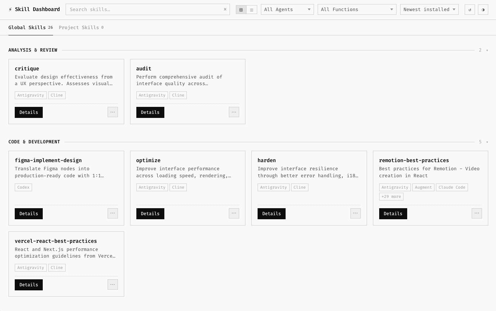

# Agent Skill Dashboard

A local web interface to manage, explore, and install your AI agent skills (`.agents/skills`, `.codex`, etc.).



## Features
- **Global & Project Scopes**: View skills installed globally vs. tied to the current project.
- **Smart Functional Grouping**: Automatically clusters your skills into functional categories (Design & UI, Code & Dev, Workflow, etc.) based on their descriptions.
- **Rich Markdown Previews**: Quickly glance at `SKILL.md` summaries without leaving the page.
- **Dark/Light Mode**: Polished interface with Fira Code typography and dark mode support.
- **Sorting & Filtering**: Find the exact skill you need by sorting by installation date or filtering by compatible agents.

## Installation

Install it globally so you can launch it from inside any project directory:

```bash
npm install -g @j7supreme/skill-dashboard
```

After install, launch it with:

```bash
skill-dashboard
```

## Requirements

- Node.js 18 or newer
- `npx` available on your `PATH`
- The `skills` CLI must be runnable through `npx -y skills ...`

## Usage

Navigate to any directory and run `skill-dashboard`.

It starts a local server on port `3847`, opens your default browser, and reads your installed skills through the standard `npx skills ls` command family.

## Chinese Content

The dashboard now keeps English as the default source content. When you switch the UI language to Simplified Chinese, the app shows a prompt that copies an agent instruction for generating localized `SKILL.zh-CN.md` files beside each original `SKILL.md`.

Behavior:
- If a skill already contains `SKILL.zh-CN.md`, the dashboard renders that Chinese version.
- If no Chinese file exists yet, the dashboard keeps showing the original English content.
- No cloud translation API or API key is required.

## Tech Stack
- Frontend: Vanilla JS, Vanilla CSS, HTML5
- Backend: Node.js, Express
- Runtime opens the browser with the `open` package

## License
MIT
